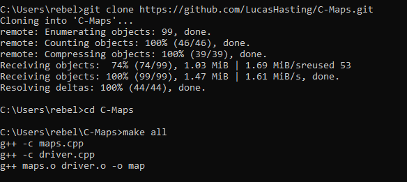
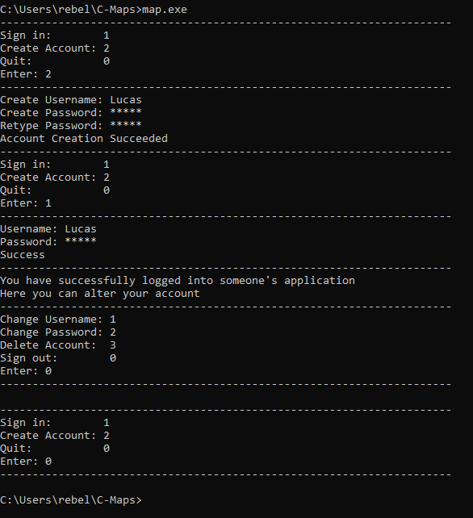

# C++ Maps Container
Project was created in my Data Structures and Algorithms class.  
Project was done with the help of Ethan Nix and Krutivas Pradhan.  

## Table of Contents

- [Installation](#installation)
- [Compile-the-program](#compile-the-program)
- [Execute-the-program](#execute-the-program)
- [Usage](#usage)
- [Example](#example)
- [Program-Overview](#program-overview)

## Installation

You need [C++](https://sourceforge.net/projects/mingw/) language installed on your system, it can be executed using the g++ compiler.

### Option 1: using [git](https://git-scm.com/downloads)
1. Clone the repository:

    ```sh
    git clone https://github.com/LucasHasting/C-Maps.git
    ```

2. Navigate to the project directory:

    ```sh
    cd C-Maps
    ```
    
### Option 2: without git
1. Download the project as a zip file
2. [Extract the zip file](https://www.wikihow.com/Unzip-a-File)
3. Find the location of the files
4. Copy the path
5. go to the command line and run the following:
   ```sh
   cd /path/to/files
   ```

## Compile the program

### Option 1: using [Make](https://www.gnu.org/software/make/)
Run the following:
```sh
make all
```

### Option 2: without Make
Run the following:
```sh
g++ maps.cpp driver.cpp -o map
```

## Execute the program

### Windows
```sh
map.exe
```

### Linux/Mac
```sh
./map.out
```

## Usage
The program is a command line, menu based, user interface. By entering the number associated with an option it will perform a certain operation. The first item displays the road (graph) with the miles included and the second item displays the road without the miles. The third option allows you to enter a path (starting point and destination), while the 4th and last option allows you to exit/quit the program.

When selecting a path it will ask for a starting vertex which is the starting point, then it will ask for a destination vertix which is the destination. It will then bring back the main menu and choosing either of the first two options will show the path highlighted red.

When selecting either of the first two options, the program will generate a pdf of the road (graph) and will try to open software that can view the pdf (such as google chrome).

## Example

  
  
  

## Program-Overview
[maps.cpp](): contains the account management simulation with the ASCII Cipher.  
[maps_demo.cpp](): contains a demonstration of how the map container can be used in C++.  
[encrypted.txt](): contains all encrypted accounts at all times.  
